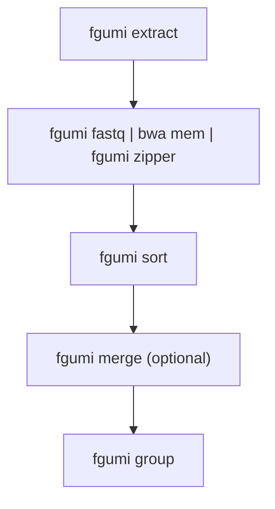
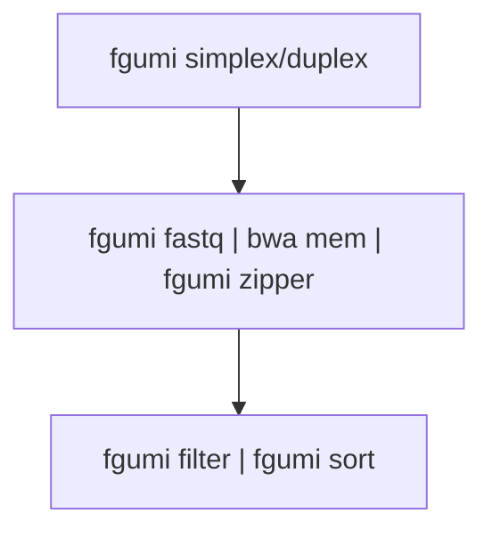
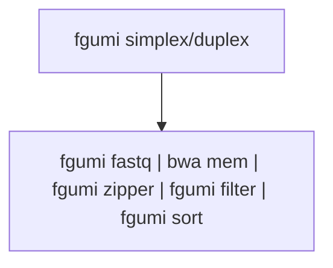
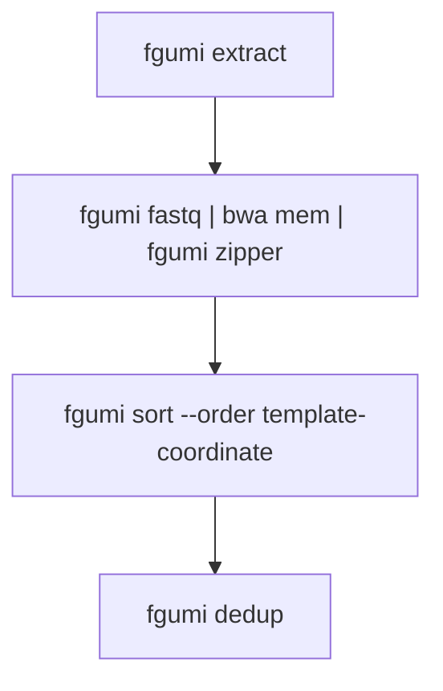

# Best Practices: FASTQ → Consensus Pipeline

This guide describes the recommended pipeline for processing FASTQ files through to consensus sequences with fgumi.

> **Tip:** Use [`fgumi runall`](running-pipelines.md) to fuse supported runs of these stages into one command — same output, no intermediate BAMs. This guide shows the stages separately so you can see and tune each one.

## Tools Required

This pipeline uses only fgumi and a read aligner:

- **fgumi** (version 0.1 or higher)
- **bwa mem** (version 0.7.17 or higher recommended)

Unlike fgbio-based pipelines, **no samtools `sort`/`merge` is required for the pipeline itself** — fgumi provides native `fastq`, `sort`, and `merge` commands. (You do still need a reference sequence dictionary (`.dict`) alongside the FASTA for `fgumi zipper`; create it once with `samtools dict` or Picard `CreateSequenceDictionary`.) In fact, you should **not** substitute `samtools sort` for `fgumi sort` ahead of `group`, `dedup`, or `downsample`: samtools ignores the `tc` tag and orders secondary/supplementary reads incorrectly for those commands (see [Troubleshooting](troubleshooting.md)).

## Common Configuration Options

### Compression Level

fgumi supports compression levels 1-12 for BAM output:

| Use Case | Level | Notes |
|----------|-------|-------|
| Final outputs | 6-9 | Balance of size and speed |
| Intermediate files | 1 | Fast compression, larger files |
| Piped commands | 1 | Minimize CPU overhead |

Set with `--compression-level N` on any command that writes BAM.

### Threading

All major fgumi commands support multi-threading via `--threads N`:

```bash
# Single-threaded (default, optimized fast path)
fgumi group --input in.bam --output out.bam --strategy adjacency

# Multi-threaded with 8 threads
fgumi group --input in.bam --output out.bam --strategy adjacency --threads 8
```

Without `--threads`, commands run on a single-threaded fast path. Pass `--threads N` to parallelize; each command splits the N threads across reading, its workers, and writing.

### Memory

fgumi's memory model differs significantly from fgbio's JVM `-Xmx`. In particular, `--max-memory` is per-thread by default and controls only pipeline queue backpressure — actual process memory will be higher. On a fixed-RAM host, pass `--max-memory auto` to size the budget to the host. See the [Performance Tuning Guide](performance-tuning.md) for detailed guidance, including a comparison table for fgbio users.

### Boolean Flags

All boolean flags accept the following values (case-insensitive): `true`/`false`, `yes`/`no`,
`y`/`n`, `t`/`f`. For example:

```bash
fgumi filter --require-single-strand-agreement yes ...
fgumi simplex --output-per-base-tags true ...
fgumi group --allow-unmapped y ...
```

---

## Pipeline Overview

<p align="center">
  
</p>

The diagram shows the workflow from FASTQ files to filtered consensus reads:
- **Red**: Simplex (single-strand) consensus
- **Blue**: Duplex (double-strand) consensus
- **Green**: CODEC consensus
- **Orange**: Optional UMI correction for fixed UMI sets

> **Tip — fused `runall`.** The per-step commands below give you full control and
> are easiest to reason about, but you can also fuse the stages into a single
> invocation with `fgumi runall` — covering
> `extract`/`correct`/`align`/`zipper`/`sort`/`group`/`consensus`/`filter`. It
> supports multiple entry points (selected with `--start-from`), each with its own
> input contract: start at `extract` (`--start-from extract`) to feed raw FASTQ
> straight through, resume from an already-extracted unmapped UMI BAM with
> `--start-from correct`, or resume a later stage from its own stage-appropriate
> BAM (`--start-from sort` from an unsorted BAM, `--start-from group` from a
> template-coordinate–sorted BAM, `--start-from consensus` from a grouped MI-tagged
> BAM). It
> streams the stages together (no intermediate BAMs on disk) and
> exposes per-stage tuning as prefixed flags (`--sort::max-memory`,
> `--group::strategy`, …). Use `--start-from`/`--stop-after` to run a sub-range of
> stages. See `fgumi runall --help` for the full surface.

### Phase 1: FASTQ → Grouped BAM



### Phase 2a: Grouped BAM → Filtered Consensus (R&D Version)



### Phase 2b: Aligned BAM → Filtered Consensus (High-Throughput Version)



---

## Choosing your path

**Phase 1 (FASTQ → grouped BAM) is universal** — every workflow runs it. The difference is in Phase 2, where you turn grouped reads into filtered consensus reads:

- **Phase 2a (R&D)** writes an intermediate consensus BAM, so you can re-run filtering with different thresholds without re-calling consensus. Choose it while you are tuning parameters.
- **Phase 2b (high-throughput)** fuses consensus calling and filtering into pipes for speed. Choose it once your parameters are locked in.

Both phases produce the same result for the same parameters. Within either phase, you can replace a run of stages with a single [`fgumi runall`](running-pipelines.md) command — the callouts below show where.

## Phase 1: FASTQ to Grouped BAM

### Step 1.1: UMI Extraction

Convert FASTQ files to unmapped BAM with UMI extraction:

```bash
fgumi extract \
  --inputs r1.fq.gz r2.fq.gz \
  --read-structures 8M+T +T \
  --sample "sample_name" \
  --library "library_name" \
  --output unmapped.bam \
  --threads 4
```

Key parameters:
- `--read-structures`: Define UMI and template positions (e.g., `8M+T` = 8bp UMI + template)

For dual-index UMIs (duplex sequencing), use paired read structures:

```bash
fgumi extract \
  --inputs r1.fq.gz r2.fq.gz \
  --read-structures 8M+T 8M+T \
  --sample "sample_name" \
  --library "library_name" \
  --output unmapped.bam
```

#### Optional: UMI Error Correction

For fixed/known UMI sets, correct sequencing errors before alignment:

```bash
fgumi correct \
  --input unmapped.bam \
  --output corrected.bam \
  --umi-files known_umis.txt \
  --min-distance 1
```

### Step 1.2: Alignment

Align reads using the fgumi fastq + zipper pipeline:

```bash
fgumi fastq --input unmapped.bam \
  | bwa mem -t 16 -p -K 150000000 -Y ref.fa - \
  | fgumi zipper --unmapped unmapped.bam --reference ref.fa --output aligned.bam
```

Key points:
- `fgumi fastq` converts BAM to interleaved FASTQ for the aligner
- `-p` tells bwa mem to expect interleaved paired-end reads
- `-K 150000000` sets batch size (improves reproducibility)
- **`-Y` is critical**: soft-clip (rather than hard-clip) supplementary alignments so their bases are preserved — `fgumi zipper` and the consensus callers need the full read sequence to transfer UMI tags and call consensus correctly
- `fgumi zipper` transfers tags from unmapped BAM to aligned reads
- `fgumi zipper` accepts SAM or BAM on stdin or `--input`. For best performance, pipe
  uncompressed BAM from the aligner (e.g. `bwa-mem3 mem --bam=0`); SAM is fine for aligners
  that can't emit BAM

For large files, add threading:

```bash
fgumi fastq --input unmapped.bam --threads 4 \
  | bwa mem -t 16 -p -K 150000000 -Y ref.fa - \
  | fgumi zipper --unmapped unmapped.bam --reference ref.fa --output aligned.bam --threads 4
```

### Step 1.3: Sorting

Sort into template-coordinate order before grouping:

```bash
fgumi sort \
  --input aligned.bam \
  --output sorted.bam \
  --order template-coordinate \
  --threads 8 \
  --max-memory 4G
```

For single-cell data, the `CB` cell barcode tag is automatically included in the
template-coordinate sort key, keeping templates from different cells at the same locus separate:

```bash
fgumi sort \
  --input aligned.bam \
  --output sorted.bam \
  --order template-coordinate \
  --threads 8
```

### Step 1.3b: (Optional) Merging Multiple BAMs

When processing multiple lanes or flowcells separately, merge the sorted BAMs before grouping.
`fgumi merge` performs an efficient k-way merge without re-sorting:

```bash
fgumi merge \
  --order template-coordinate \
  --output merged.bam \
  lane1_sorted.bam lane2_sorted.bam lane3_sorted.bam
```

For large numbers of files, use `--input-list`:

```bash
fgumi merge \
  --order template-coordinate \
  --input-list bam_paths.txt \
  --output merged.bam
```

For single-cell data, the `CB` cell barcode tag is automatically included in the merge key.

All inputs must be sorted in the same order as `--order`. Do not use `samtools merge` for
template-coordinate BAMs — it does not understand the `tc` tag that `fgumi zipper` adds, and
will produce incorrect ordering.

### Step 1.4: UMI Grouping

Group reads by UMI using the appropriate strategy:

**For simplex/single-UMI workflows:**

```bash
fgumi group \
  --input sorted.bam \
  --output grouped.bam \
  --strategy adjacency \
  --edits 1 \
  --metrics group_metrics \
  --threads 8
```

**For duplex/paired-UMI workflows:**

```bash
fgumi group \
  --input sorted.bam \
  --output grouped.bam \
  --strategy paired \
  --edits 1 \
  --metrics group_metrics \
  --threads 8
```

The `--metrics PREFIX` flag writes all three metrics files in one step:
- `PREFIX.family_sizes.txt` — family size histogram
- `PREFIX.grouping_metrics.txt` — grouping statistics
- `PREFIX.position_group_sizes.txt` — UMI families per genomic position

These can also be written to explicit paths with `--family-size-histogram` and
`--grouping-metrics`.

**For workflows with unmapped templates** (e.g., some cfDNA assays):

```bash
fgumi group \
  --input sorted.bam \
  --output grouped.bam \
  --strategy adjacency \
  --allow-unmapped \
  --metrics group_metrics
```

By default, templates where all reads are unmapped are excluded. `--allow-unmapped` includes
them so their UMIs are still tracked and grouped with any mapped reads from the same molecule.

### Step 1.5: (Optional) QC Metrics Before Consensus

For **simplex** libraries, collect QC metrics from the grouped BAM:

```bash
fgumi simplex-metrics \
  --input grouped.bam \
  --output simplex_metrics \
  --min-reads 3
```

This produces `simplex_metrics.family_sizes.txt`, `simplex_metrics.simplex_yield_metrics.txt`,
`simplex_metrics.umi_counts.txt`, and optionally a PDF plot. The yield metrics show how the
number of callable consensus reads scales with sequencing depth (computed at 5%, 10%, …, 100%
of reads), so you can assess whether deeper sequencing would materially improve yield.

For **duplex** libraries, use `duplex-metrics`:

```bash
fgumi duplex-metrics \
  --input grouped.bam \
  --output duplex_metrics
```

---

## Phase 2a: R&D Pipeline (Separate Consensus and Filtering)

This approach generates an intermediate consensus BAM, allowing you to experiment with different filtering parameters without re-running consensus calling.

### Step 2a.1: Consensus Calling

**Simplex consensus:**

```bash
fgumi simplex \
  --input grouped.bam \
  --output consensus.bam \
  --min-reads 1 \
  --min-input-base-quality 20 \
  --output-per-base-tags true \
  --threads 8
```

**Duplex consensus:**

```bash
fgumi duplex \
  --input grouped.bam \
  --output consensus.bam \
  --min-reads 1 \
  --min-input-base-quality 20 \
  --output-per-base-tags true \
  --threads 8
```

Key parameters:
- `--min-reads 1`: Keep all consensus reads (filter later)
- `--output-per-base-tags true`: Enable per-base filtering downstream
- `--min-input-base-quality`: Minimum quality for input bases (default: 10)

Note: `--output-per-base-tags` accepts `true`/`false`, `yes`/`no`, `y`/`n`, or `t`/`f`.

### Step 2a.2: Re-alignment

Consensus reads are unmapped and must be re-aligned:

```bash
fgumi fastq --input consensus.bam \
  | bwa mem -t 16 -p -K 150000000 -Y ref.fa - \
  | fgumi zipper --unmapped consensus.bam --reference ref.fa --output consensus.mapped.bam
```

### Step 2a.3: Filtering

Filter consensus reads with desired stringency:

**Simplex filtering:**

```bash
fgumi filter \
  --input consensus.mapped.bam \
  --output filtered.bam \
  --ref ref.fa \
  --min-reads 3 \
  --max-read-error-rate 0.025 \
  --max-base-error-rate 0.1 \
  --min-base-quality 40 \
  --max-no-call-fraction 0.2 \
  --reverse-per-base-tags \
  --threads 8
```

**Duplex filtering (with strand-specific thresholds):**

```bash
fgumi filter \
  --input consensus.mapped.bam \
  --output filtered.bam \
  --ref ref.fa \
  --min-reads 10,5,3 \
  --max-read-error-rate 0.025 \
  --max-base-error-rate 0.1 \
  --min-base-quality 40 \
  --max-no-call-fraction 0.2 \
  --reverse-per-base-tags \
  --require-single-strand-agreement true \
  --threads 8
```

For duplex, `--min-reads 10,5,3` means:
- 10 raw reads minimum for final duplex consensus
- 5 raw reads minimum for AB single-strand consensus
- 3 raw reads minimum for BA single-strand consensus

### Step 2a.4: Final Sort (if needed)

Sort to coordinate order for downstream tools:

```bash
fgumi sort \
  --input filtered.bam \
  --output final.bam \
  --order coordinate \
  --threads 8
```

---

## Phase 2b: Aligned BAM → Filtered Consensus (High-Throughput Version)

For production use where filtering parameters are established, combine steps for better throughput.

> **Recommended:** run Step 2b.1 as a single `fgumi runall` command instead of a pipe — it fuses
> sort, group, and consensus in memory with no intermediate BAM:
>
> ```bash
> fgumi runall \
>   --start-from sort --stop-after consensus --consensus simplex \
>   --input aligned.bam --output consensus.bam \
>   --group::strategy adjacency --simplex::min-reads 1 \
>   --simplex::output-per-base-tags true \
>   --threads 8
> ```
>
> See [Running Pipelines](running-pipelines.md).

### Step 2b.1: Group and Call Consensus (manual pipe)

`fgumi group` requires template-coordinate-sorted input, so sort once up front (the
`runall --start-from sort` example above folds this same `sort` step into the fused chain).
`fgumi sort` writes a file, so it is a separate command rather than a pipe stage; the
group → consensus fusion then runs as a single pipe with no intermediate consensus BAM:

```bash
fgumi sort --input aligned.bam --output sorted.bam --order template-coordinate --threads 4

fgumi group --input sorted.bam --strategy adjacency --threads 4 --compression-level 1 \
  | fgumi simplex --input /dev/stdin --min-reads 1 --output-per-base-tags true \
    --output consensus.bam --threads 4 --compression-level 1
```

### Step 2b.2: Re-align, Filter, and Sort

```bash
fgumi fastq --input consensus.bam \
  | bwa mem -t 16 -p -K 150000000 -Y ref.fa - \
  | fgumi zipper --unmapped consensus.bam --reference ref.fa \
  | fgumi filter --input /dev/stdin --ref ref.fa --min-reads 3 \
  | fgumi sort --input /dev/stdin --output filtered.bam --order coordinate --threads 4
```

Note: Steps 2b.1 and 2b.2 cannot be fused into one pipe because re-aligning the consensus reads in Step 2b.2 requires the consensus BAM to be materialized first (via `fgumi zipper --unmapped`). `fgumi runall` fuses the in-memory stages *within* Step 2b.1; the consensus re-alignment in Step 2b.2 remains a separate pass. For most use cases, the R&D pipeline with intermediate files (Phase 2a) provides better debuggability and flexibility.

---

## Alternative: Deduplication Without Consensus

For workflows that need UMI-aware duplicate marking without consensus calling (e.g., when downstream tools handle deduplication differently, or for QC purposes), use `fgumi dedup`:



### Dedup Pipeline

```bash
# Step 1: Extract UMIs from FASTQ
fgumi extract \
  --inputs r1.fq.gz r2.fq.gz \
  --read-structures 8M+T 8M+T \
  --sample "sample_name" \
  --library "library_name" \
  --output unmapped.bam

# Step 2: Align reads (fgumi zipper adds required `tc` tag)
fgumi fastq --input unmapped.bam \
  | bwa mem -t 16 -p -K 150000000 -Y ref.fa - \
  | fgumi zipper --unmapped unmapped.bam --reference ref.fa --output aligned.bam

# Step 3: Sort with fgumi (required - samtools sort won't work)
fgumi sort --input aligned.bam --output sorted.bam --order template-coordinate

# Step 4: Mark duplicates
fgumi dedup --input sorted.bam --output deduped.bam --metrics metrics.txt
```

**Important:** You MUST use `fgumi zipper` and `fgumi sort` before `fgumi dedup`:
- `fgumi zipper` adds the `tc` (template-coordinate) tag to secondary/supplementary reads
- `fgumi sort --order template-coordinate` keeps all alignments for a template together; downstream `fgumi dedup` uses the `tc` tag to validate input
- `samtools sort --template-coordinate` does NOT understand the `tc` tag and will produce incorrect results for dedup

### Dedup Options

```bash
# Remove duplicates instead of marking
fgumi dedup --input sorted.bam --output deduped.bam --remove-duplicates true

# Use a different UMI strategy (default: adjacency)
fgumi dedup --input sorted.bam --output deduped.bam --strategy paired --edits 1

# Write family size histogram
fgumi dedup --input sorted.bam --output deduped.bam \
  --metrics metrics.txt \
  --family-size-histogram histogram.txt
```

---

## Recommended Parameters by Application

Pick a starting point by how you trade sensitivity against specificity for your assay, then tune from there.

### Variant Calling (High Sensitivity)

Maximize the number of consensus reads (keep singletons, tolerate more error) when you would rather not miss a true variant — e.g. germline or high-depth somatic calling.

```bash
fgumi simplex --min-reads 1 --min-input-base-quality 10
fgumi filter --min-reads 2 --max-base-error-rate 0.2 --max-no-call-fraction 0.3
```

### Variant Calling (High Specificity)

Suppress false positives with duplex consensus and stringent thresholds, at the cost of yield — e.g. low-frequency somatic calling where a wrong call is costly.

```bash
fgumi duplex --min-reads 1 --min-input-base-quality 20
fgumi filter --min-reads 10,5,3 --max-base-error-rate 0.1 --max-no-call-fraction 0.1 \
  --require-single-strand-agreement true
```

### Liquid Biopsy / ctDNA

Detect very-low-frequency variants in cell-free DNA, where input is limited so duplex thresholds are relaxed slightly relative to high-specificity calling while still requiring strand agreement.

```bash
fgumi duplex --min-reads 1 --min-input-base-quality 20
fgumi filter --min-reads 3,2,2 --max-base-error-rate 0.05 \
  --require-single-strand-agreement true
```

---

## Troubleshooting

### Low Consensus Yield

1. Check family size distribution with `--metrics` on `fgumi group`
2. Lower `--min-reads` threshold
3. Verify UMI extraction with correct `--read-structures`
4. Run `fgumi simplex-metrics` or `fgumi duplex-metrics` on the grouped BAM to assess yield curves

### High Error Rates

1. Increase `--min-input-base-quality` during consensus calling
2. Tighten `--max-base-error-rate` during filtering
3. For duplex, use `--require-single-strand-agreement true`

### Memory Issues

1. Use `--max-memory` with `fgumi sort` to limit RAM usage
2. Reduce `--threads` (fewer threads = less memory)
3. Process in smaller batches
4. See [Performance Tuning](performance-tuning.md) for detailed guidance

---

## See Also

- [UMI Grouping](umi-grouping.md) — grouping strategies and cell barcode support
- [Working with Metrics](working-with-metrics.md) — metrics file formats and interpretation
- [Performance Tuning](performance-tuning.md) — threading, memory, and compression
