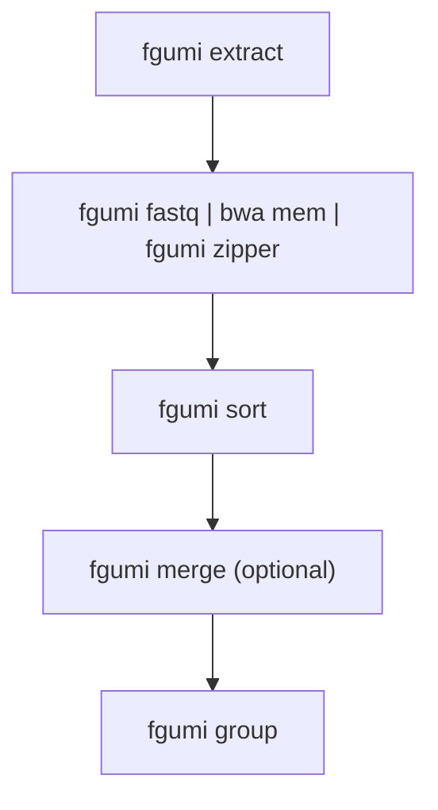
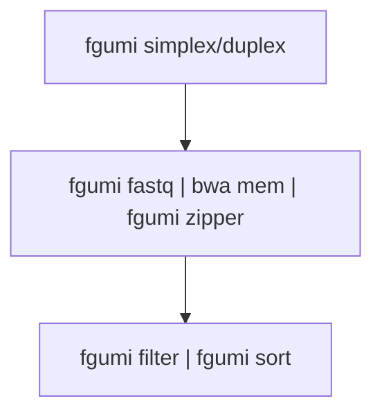
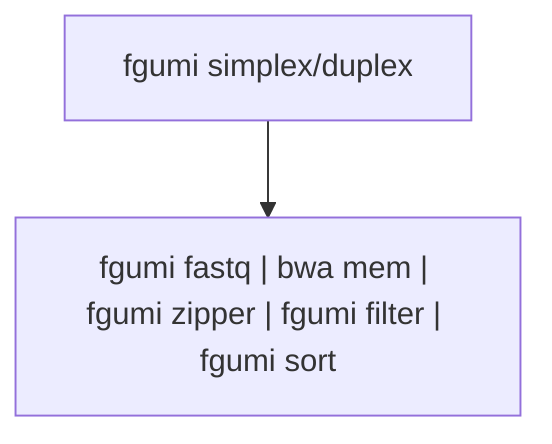
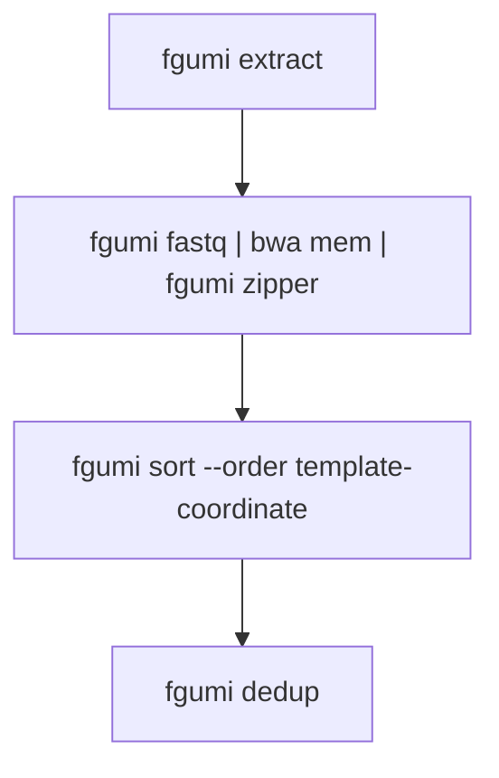

# fgumi Best Practice FASTQ -> Consensus Pipeline

This document describes the recommended best practice pipeline for processing FASTQ files through to consensus sequences using fgumi.

## Tools Required

This pipeline uses only fgumi and a read aligner:

- **fgumi** (version 0.1 or higher)
- **bwa mem** (version 0.7.17 or higher recommended)

Unlike fgbio-based pipelines, **no samtools is required** - fgumi provides native `fastq`, `sort`, and `merge` commands.

## Common Configuration Options

### Compression Level

fgumi supports compression levels 1-12 for BAM output:

| Use Case | Level | Notes |
|----------|-------|-------|
| Final outputs | 6-9 | Balance of size and speed |
| Intermediate files | 1 | Fast compression, larger files |
| Piped commands | 1 | Minimize CPU overhead |

Set with `--compression-level N` on any command that writes BAM.

### Threading

All major fgumi commands support multi-threading via `--threads N`:

```bash
# Single-threaded (default, optimized fast path)
fgumi group --input in.bam --output out.bam --strategy adjacency

# Multi-threaded with 8 threads
fgumi group --input in.bam --output out.bam --strategy adjacency --threads 8
```

Thread allocation is automatically optimized per-command based on workload profiling.

### Memory

fgumi's memory model differs significantly from fgbio's JVM `-Xmx`. In particular, `--queue-memory` is per-thread by default and controls only pipeline queue backpressure — actual process memory will be higher. See the [Performance Tuning Guide](performance-tuning.md) for detailed guidance, including a comparison table for fgbio users.

### Boolean Flags

All boolean flags accept the following values (case-insensitive): `true`/`false`, `yes`/`no`,
`y`/`n`, `t`/`f`. For example:

```bash
fgumi filter --require-single-strand-agreement yes ...
fgumi simplex --output-per-base-tags true ...
fgumi group --allow-unmapped y ...
```

---

## Pipeline Overview

<p align="center">
  
</p>

The diagram shows the workflow from FASTQ files to filtered consensus reads:
- **Red**: Simplex (single-strand) consensus
- **Blue**: Duplex (double-strand) consensus
- **Green**: CODEC consensus
- **Orange**: Optional UMI correction for fixed UMI sets

### Phase 1: FASTQ → Grouped BAM



### Phase 2a: Grouped BAM → Filtered Consensus (R&D Version)



### Phase 2b: Aligned BAM → Filtered Consensus (High-Throughput Version)



---

## Phase 1: FASTQ to Grouped BAM

### Step 1.1: UMI Extraction

Convert FASTQ files to unmapped BAM with UMI extraction:

```bash
fgumi extract \
  --inputs r1.fq.gz r2.fq.gz \
  --read-structures 8M+T +T \
  --sample "sample_name" \
  --library "library_name" \
  --output unmapped.bam \
  --threads 4
```

Key parameters:
- `--read-structures`: Define UMI and template positions (e.g., `8M+T` = 8bp UMI + template)

For dual-index UMIs (duplex sequencing), use paired read structures:

```bash
fgumi extract \
  --inputs r1.fq.gz r2.fq.gz \
  --read-structures 8M+T 8M+T \
  --sample "sample_name" \
  --library "library_name" \
  --output unmapped.bam
```

#### Optional: UMI Error Correction

For fixed/known UMI sets, correct sequencing errors before alignment:

```bash
fgumi correct \
  --input unmapped.bam \
  --output corrected.bam \
  --umi-files known_umis.txt \
  --min-distance 1
```

### Step 1.2: Alignment

Align reads using the fgumi fastq + zipper pipeline:

```bash
fgumi fastq --input unmapped.bam \
  | bwa mem -t 16 -p -K 150000000 -Y ref.fa - \
  | fgumi zipper --unmapped unmapped.bam --reference ref.fa --output aligned.bam
```

Key points:
- `fgumi fastq` converts BAM to interleaved FASTQ for the aligner
- `-p` tells bwa mem to expect interleaved paired-end reads
- `-K 150000000` sets batch size (improves reproducibility)
- **`-Y` is critical**: Use soft-clipping for supplementary alignments to preserve bases
- `fgumi zipper` transfers tags from unmapped BAM to aligned reads
- `fgumi zipper` accepts SAM piped from the aligner (preferred) or a BAM file via `--input`;
  piping SAM avoids an extra encode/decode step

For large files, add threading:

```bash
fgumi fastq --input unmapped.bam --threads 4 \
  | bwa mem -t 16 -p -K 150000000 -Y ref.fa - \
  | fgumi zipper --unmapped unmapped.bam --reference ref.fa --output aligned.bam --threads 4
```

### Step 1.3: Sorting

Sort into template-coordinate order before grouping:

```bash
fgumi sort \
  --input aligned.bam \
  --output sorted.bam \
  --order template-coordinate \
  --threads 8 \
  --max-memory 4G
```

For single-cell data, the `CB` cell barcode tag is automatically included in the
template-coordinate sort key, keeping templates from different cells at the same locus separate:

```bash
fgumi sort \
  --input aligned.bam \
  --output sorted.bam \
  --order template-coordinate \
  --threads 8
```

### Step 1.3b: (Optional) Merging Multiple BAMs

When processing multiple lanes or flowcells separately, merge the sorted BAMs before grouping.
`fgumi merge` performs an efficient k-way merge without re-sorting:

```bash
fgumi merge \
  --order template-coordinate \
  --output merged.bam \
  lane1_sorted.bam lane2_sorted.bam lane3_sorted.bam
```

For large numbers of files, use `--input-list`:

```bash
fgumi merge \
  --order template-coordinate \
  --input-list bam_paths.txt \
  --output merged.bam
```

For single-cell data, the `CB` cell barcode tag is automatically included in the merge key.

All inputs must be sorted in the same order as `--order`. Do not use `samtools merge` for
template-coordinate BAMs — it does not understand the `pa` tag that `fgumi sort` adds, and
will produce incorrect ordering.

### Step 1.4: UMI Grouping

Group reads by UMI using the appropriate strategy:

**For simplex/single-UMI workflows:**

```bash
fgumi group \
  --input sorted.bam \
  --output grouped.bam \
  --strategy adjacency \
  --edits 1 \
  --metrics group_metrics \
  --threads 8
```

**For duplex/paired-UMI workflows:**

```bash
fgumi group \
  --input sorted.bam \
  --output grouped.bam \
  --strategy paired \
  --edits 1 \
  --metrics group_metrics \
  --threads 8
```

The `--metrics PREFIX` flag writes all three metrics files in one step:
- `PREFIX.family_sizes.txt` — family size histogram
- `PREFIX.grouping_metrics.txt` — grouping statistics
- `PREFIX.position_group_sizes.txt` — UMI families per genomic position

These can also be written to explicit paths with `--family-size-histogram` and
`--grouping-metrics`.

**For workflows with unmapped templates** (e.g., some cfDNA assays):

```bash
fgumi group \
  --input sorted.bam \
  --output grouped.bam \
  --strategy adjacency \
  --allow-unmapped \
  --metrics group_metrics
```

By default, templates where all reads are unmapped are excluded. `--allow-unmapped` includes
them so their UMIs are still tracked and grouped with any mapped reads from the same molecule.

### Step 1.5: (Optional) QC Metrics Before Consensus

For **simplex** libraries, collect QC metrics from the grouped BAM:

```bash
fgumi simplex-metrics \
  --input grouped.bam \
  --output simplex_metrics \
  --min-reads 3
```

This produces `simplex_metrics.family_sizes.txt`, `simplex_metrics.simplex_yield_metrics.txt`,
`simplex_metrics.umi_counts.txt`, and optionally a PDF plot. The yield metrics show how the
number of callable consensus reads scales with sequencing depth (computed at 5%, 10%, …, 100%
of reads), so you can assess whether deeper sequencing would materially improve yield.

For **duplex** libraries, use `duplex-metrics`:

```bash
fgumi duplex-metrics \
  --input grouped.bam \
  --output duplex_metrics
```

---

## Phase 2a: R&D Pipeline (Separate Consensus and Filtering)

This approach generates an intermediate consensus BAM, allowing you to experiment with different filtering parameters without re-running consensus calling.

### Step 2a.1: Consensus Calling

**Simplex consensus:**

```bash
fgumi simplex \
  --input grouped.bam \
  --output consensus.bam \
  --min-reads 1 \
  --min-input-base-quality 20 \
  --output-per-base-tags true \
  --threads 8
```

**Duplex consensus:**

```bash
fgumi duplex \
  --input grouped.bam \
  --output consensus.bam \
  --min-reads 1 \
  --min-input-base-quality 20 \
  --output-per-base-tags true \
  --threads 8
```

Key parameters:
- `--min-reads 1`: Keep all consensus reads (filter later)
- `--output-per-base-tags true`: Enable per-base filtering downstream
- `--min-input-base-quality`: Minimum quality for input bases (default: 10)

Note: `--output-per-base-tags` accepts `true`/`false`, `yes`/`no`, `y`/`n`, or `t`/`f`.

### Step 2a.2: Re-alignment

Consensus reads are unmapped and must be re-aligned:

```bash
fgumi fastq --input consensus.bam \
  | bwa mem -t 16 -p -K 150000000 -Y ref.fa - \
  | fgumi zipper --unmapped consensus.bam --reference ref.fa --output consensus.mapped.bam
```

### Step 2a.3: Filtering

Filter consensus reads with desired stringency:

**Simplex filtering:**

```bash
fgumi filter \
  --input consensus.mapped.bam \
  --output filtered.bam \
  --ref ref.fa \
  --min-reads 3 \
  --max-read-error-rate 0.025 \
  --max-base-error-rate 0.1 \
  --min-base-quality 40 \
  --max-no-call-fraction 0.2 \
  --reverse-per-base-tags \
  --threads 8
```

**Duplex filtering (with strand-specific thresholds):**

```bash
fgumi filter \
  --input consensus.mapped.bam \
  --output filtered.bam \
  --ref ref.fa \
  --min-reads 10,5,3 \
  --max-read-error-rate 0.025 \
  --max-base-error-rate 0.1 \
  --min-base-quality 40 \
  --max-no-call-fraction 0.2 \
  --reverse-per-base-tags \
  --require-single-strand-agreement true \
  --threads 8
```

For duplex, `--min-reads 10,5,3` means:
- 10 raw reads minimum for final duplex consensus
- 5 raw reads minimum for AB single-strand consensus
- 3 raw reads minimum for BA single-strand consensus

### Step 2a.4: Final Sort (if needed)

Sort to coordinate order for downstream tools:

```bash
fgumi sort \
  --input filtered.bam \
  --output final.bam \
  --order coordinate \
  --threads 8
```

---

## Phase 2b: Aligned BAM → Filtered Consensus (High-Throughput Version)

For production use where filtering parameters are established, combine steps for better throughput.

**Stage 1: Group and call consensus in a single pipe:**

```bash
fgumi group --input aligned.bam --strategy adjacency --threads 4 --compression-level 1 \
  | fgumi simplex --input /dev/stdin --min-reads 1 --output-per-base-tags true \
    --output consensus.bam --threads 4 --compression-level 1
```

**Stage 2: Align, filter, and sort in a single pipe:**

```bash
fgumi fastq --input consensus.bam \
  | bwa mem -t 16 -p -K 150000000 -Y ref.fa - \
  | fgumi zipper --unmapped consensus.bam --reference ref.fa \
  | fgumi filter --input /dev/stdin --ref ref.fa --min-reads 3 \
  | fgumi sort --input /dev/stdin --output filtered.bam --order coordinate --threads 4
```

Note: The two stages cannot be combined into a single pipeline because `fgumi zipper --unmapped` needs random access to the consensus BAM. For most use cases, the R&D pipeline with intermediate files provides better debuggability and flexibility.

---

## Alternative: Deduplication Without Consensus

For workflows that need UMI-aware duplicate marking without consensus calling (e.g., when downstream tools handle deduplication differently, or for QC purposes), use `fgumi dedup`:



### Dedup Pipeline

```bash
# Step 1: Extract UMIs from FASTQ
fgumi extract \
  --inputs r1.fq.gz r2.fq.gz \
  --read-structures 8M+T 8M+T \
  --sample "sample_name" \
  --library "library_name" \
  --output unmapped.bam

# Step 2: Align reads (fgumi zipper adds required `pa` tag)
fgumi fastq --input unmapped.bam \
  | bwa mem -t 16 -p -K 150000000 -Y ref.fa - \
  | fgumi zipper --unmapped unmapped.bam --reference ref.fa --output aligned.bam

# Step 3: Sort with fgumi (required - samtools sort won't work)
fgumi sort --input aligned.bam --output sorted.bam --order template-coordinate

# Step 4: Mark duplicates
fgumi dedup --input sorted.bam --output deduped.bam --metrics metrics.txt
```

**Important:** You MUST use `fgumi zipper` and `fgumi sort` before `fgumi dedup`:
- `fgumi zipper` adds the `pa` (primary alignment) tag to secondary/supplementary reads
- `fgumi sort --order template-coordinate` uses this tag to keep all alignments for a template together
- `samtools sort --template-coordinate` does NOT understand the `pa` tag and will produce incorrect results

### Dedup Options

```bash
# Remove duplicates instead of marking
fgumi dedup --input sorted.bam --output deduped.bam --remove-duplicates true

# Use a different UMI strategy (default: adjacency)
fgumi dedup --input sorted.bam --output deduped.bam --strategy paired --edits 1

# Write family size histogram
fgumi dedup --input sorted.bam --output deduped.bam \
  --metrics metrics.txt \
  --family-size-histogram histogram.txt
```

---

## Recommended Parameters by Application

### Variant Calling (High Sensitivity)

```bash
fgumi simplex --min-reads 1 --min-input-base-quality 10
fgumi filter --min-reads 2 --max-base-error-rate 0.2 --max-no-call-fraction 0.3
```

### Variant Calling (High Specificity)

```bash
fgumi duplex --min-reads 1 --min-input-base-quality 20
fgumi filter --min-reads 10,5,3 --max-base-error-rate 0.1 --max-no-call-fraction 0.1 \
  --require-single-strand-agreement true
```

### Liquid Biopsy / ctDNA

```bash
fgumi duplex --min-reads 1 --min-input-base-quality 20
fgumi filter --min-reads 3,2,2 --max-base-error-rate 0.05 \
  --require-single-strand-agreement true
```

---

## Troubleshooting

### Low Consensus Yield

1. Check family size distribution with `--metrics` on `fgumi group`
2. Lower `--min-reads` threshold
3. Verify UMI extraction with correct `--read-structures`
4. Run `fgumi simplex-metrics` or `fgumi duplex-metrics` on the grouped BAM to assess yield curves

### High Error Rates

1. Increase `--min-input-base-quality` during consensus calling
2. Tighten `--max-base-error-rate` during filtering
3. For duplex, use `--require-single-strand-agreement true`

### Memory Issues

1. Use `--max-memory` with `fgumi sort` to limit RAM usage
2. Reduce `--threads` (fewer threads = less memory)
3. Process in smaller batches
4. See [Performance Tuning](performance-tuning.md) for detailed guidance

---

## See Also

- [UMI Grouping](umi-grouping.md) — grouping strategies and cell barcode support
- [Working with Metrics](working-with-metrics.md) — metrics file formats and interpretation
- [Performance Tuning](performance-tuning.md) — threading, memory, and compression
