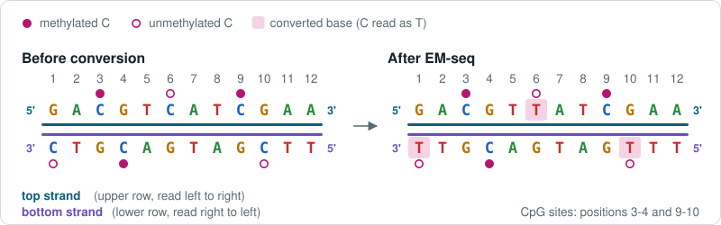
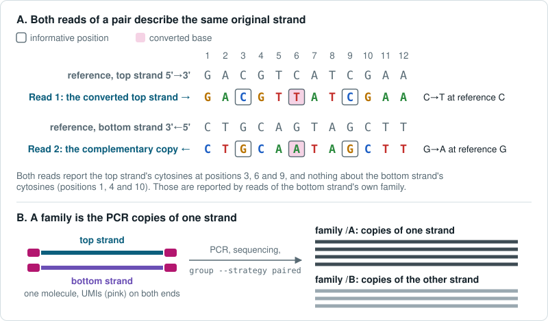
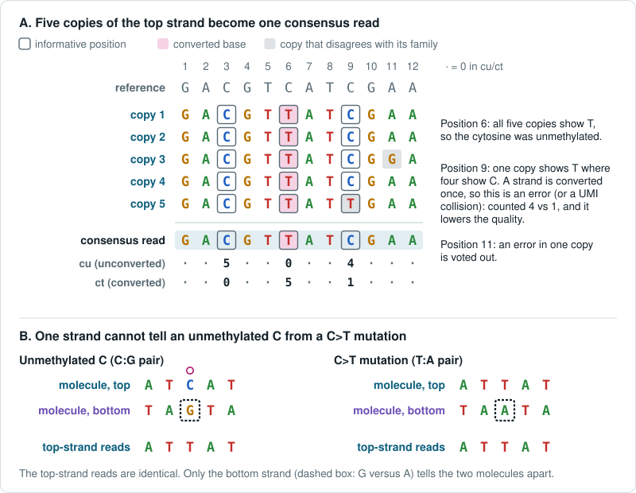
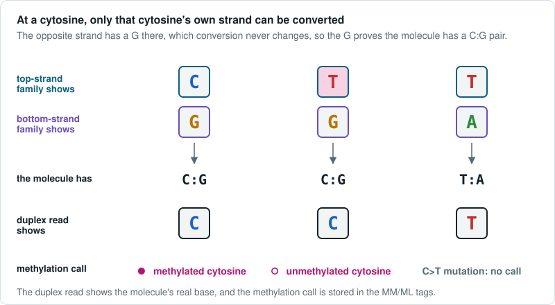

# Methylation Concepts

This page explains what fgumi's methylation consensus reads report and why. It is written for anyone who uses the output; no knowledge of fgumi's internals is needed. The [Methylation Pipeline Guide](methylation.md) has the commands, and the reference for every option and tag.

The figures use short made-up sequences and show EM-seq. TAPs works the same way with the meaning of C and T swapped (see [TAPs](#taps)).

## What You Get

fgumi collapses the reads of each original DNA molecule into a consensus read, and in methylation mode it records the methylation evidence on that read. There are two kinds of consensus:

- **Simplex**: one read per strand of each molecule. It looks like an ordinary bisulfite read, with the converted bases kept, so it is aligned with a bisulfite-aware aligner and its methylation is read by tools such as MethylDackel.
- **Duplex**: one read per molecule, built from both strands. Its sequence is the molecule's real DNA, and each strand's methylation is stored in the standard `MM`/`ML` tags, for tools such as `modkit pileup-hemi`. Variant callers can use it directly.

[Choosing Simplex or Duplex](#choosing-simplex-or-duplex) compares them.

## Conversion

DNA has two strands, and each strand carries its own methylation marks. In mammals most methylation is at **CpG** sites, a C followed by a G. A CpG on one strand faces a CpG on the other, so every CpG site has two cytosines, one on each strand, and they are methylated independently.

Here the **top strand** is the reference's forward strand, as written in the FASTA, and the **bottom strand** is its complement. These labels are unrelated to Read 1 and Read 2, and to the `/A` and `/B` families below.

EM-seq converts every *unmethylated* C to U, which sequencing reads as T. A methylated C is protected and stays C. After conversion, a C in a read means methylated, and a T where the genome has a C means unmethylated.

*Each strand is converted on its own. The unmethylated top-strand C at position 6 and the unmethylated bottom-strand cytosines at positions 1 and 10 are read as T; the methylated cytosines stay C. The CpG at positions 9-10 is methylated on the top strand only.*

### TAPs

TAPs converts the *methylated* C instead, so a T at a reference C means methylated and a C means unmethylated. Everything else on this page is the same. fgumi takes the chemistry from `--methylation-mode em-seq` or `--methylation-mode taps`, and a wrong setting inverts every call.

## What Each Read Sees

Library preparation copies the converted strand. In a **directional** library, the kind fgumi supports, Read 1 of each pair sequences the converted original strand and Read 2 sequences the copy made from it. Both reads describe the same original strand. Read 1 shows its conversions as C→T, where the reference has a C. Read 2 reads the complementary copy, so it shows the same conversions as G→A, opposite those cytosines. These positions are the read's **informative positions**: the only places where it says anything about methylation. This holds whichever strand the molecule came from, as long as each read is read in its own 5'→3' direction. A genome browser shows every read on the reference's forward strand instead, so there both reads of a top-strand molecule show C→T and both reads of a bottom-strand molecule show G→A.

A **UMI** (unique molecular identifier) is a short tag added to each molecule before PCR, so reads with the same UMI at the same position came from the same molecule. PCR copies each converted strand many times, and the copies of one strand form a **family**. With UMIs on both ends, `fgumi group --strategy paired` also tells the two strands of a molecule apart: one strand's reads form family `/A`, the other's family `/B`, and both share the molecule's ID (the `MI` tag). Which strand becomes `/A` depends on the reads' positions, not on top or bottom.

*A: Read 1 shows the unmethylated cytosine at position 6 as a T; Read 2 shows an A opposite it. Both reads report only the cytosines of the original strand they both describe. B: the copies of each strand form their own family.*

## What Must Agree

Copies of one strand must agree on everything. The two strands of a molecule must agree on the DNA sequence, but not on methylation.

| | DNA sequence | Methylation |
|---|---|---|
| **Within one family** (copies of one strand) | Must agree. A read that differs has a sequencing or PCR error, and the consensus votes it down. | Must agree. The strand was converted once, before PCR, so a C/T split inside a family is an error or a UMI collision, not partial methylation. It lowers the consensus quality like any other error. |
| **Across the two strands** of a molecule | Must agree. The strands are two halves of one double helix, and duplex uses this to confirm each base. | Free to differ. Each strand carries its own marks, and a CpG methylated on one strand only is real biology ([hemimethylation](#hemimethylation)). fgumi never requires the strands to agree. |

## Why Two Alignments

A standard aligner counts every converted T as a mismatch, so a well-converted EM-seq read can look too different from the genome to place. A bisulfite-aware aligner, such as `bwa-mem3 mem --meth` or bwameth, matches the read with every C treated as a T and then scores it against the real reference. `bwa-mem3 mem --meth` also writes `XG` (the original strand: `CT` for top, `GA` for bottom), `XR`, and `XM`, a per-base methylation call in Bismark's format: upper case is methylated and lower case unmethylated, with `Z`/`z` for CpG, `X`/`x` for CHG and `H`/`h` for CHH (H is any base but G). bwameth writes `YC`/`YD` instead, which MethylDackel reads.

The pipeline aligns twice. The raw reads are aligned first, so that the reads of each molecule can be grouped. The consensus reads are new, unaligned sequences and are aligned again, with the aligner that suits the consensus: a simplex read still shows its converted bases and goes back through the bisulfite-aware aligner, while a duplex read is the molecule's real sequence and goes through a standard aligner. TAPs converts only methylated cytosines, which are few, so TAPs reads align with a standard aligner throughout.

## Simplex Consensus

`fgumi simplex` collapses each family into one read. An error that appears in only a few copies is voted out. At each informative position, simplex also counts the copies that show the unconverted base (`cu`) and the copies that show the converted base (`ct`).

*A: the consensus keeps the T at position 6. At position 9 one copy disagrees with the other four; within one strand that is an error (or a UMI collision), so it is counted (4 versus 1) and lowers the quality there. B: an unmethylated cytosine and a C>T mutation give the same top-strand reads.*

The simplex read keeps the observed bases, so an unmethylated cytosine stays a T. One strand cannot tell an unmethylated C from a C>T mutation (panel B), so simplex reports what it saw. Simplex calls are therefore **reference-anchored**: a T counts as a converted cytosine because the reference has a C there, the same assumption every standard bisulfite tool makes. Re-align the simplex read with the bisulfite-aware aligner and read its methylation with a sequence-based caller: MethylDackel, Bismark's methylation extractor, or the `XM` tag from `bwa-mem3 mem --meth`.

Simplex writes no `MM`/`ML` tags. Those tags can only describe bases that appear in the read, and a converted cytosine appears as a T.

## Duplex Consensus

`fgumi duplex` combines the two families of a molecule into one read. Conversion acts only on a cytosine's own strand: opposite a top-strand C, the bottom strand has a G, and conversion never changes that G. So the bottom strand proves that the molecule has a C:G pair there, and the top strand's C or T is the methylation call. The same holds the other way round for the bottom strand's cytosines.

Each strand's bases below are written in that strand's own letters, as in the figure.

| Top strand shows | Bottom strand shows | The molecule has | The duplex read shows | Methylation call |
|---|---|---|---|---|
| C | G | C:G | C | top-strand cytosine, methylated |
| T | G | C:G | C | top-strand cytosine, unmethylated |
| G | C | G:C | G | bottom-strand cytosine, methylated |
| G | T | G:C | G | bottom-strand cytosine, unmethylated |
| T | A | T:A | T | none; at a reference C this is a C>T mutation |
| anything else (C with A, G with G, ...) | | unclear | resolved by the ordinary [duplex rules](duplex-consensus-calling.md) | none |

The duplex read therefore carries the molecule's actual sequence, with every confirmed cytosine shown as C (or G). Each strand's calls are stored in `MM`/`ML`, and `cu`/`ct` count the reads of the cytosine's own strand. Align the duplex read with a standard aligner and read it with `modkit pileup-hemi`; variant callers can use it as is.

Duplex calls are **molecule-based**: the molecule's two strands, not the reference, decide where its cytosines are. A cytosine the reference lacks (for example a variant that creates a CpG) is called, and a C>T mutation gets no call. Tools such as MethylDackel and `modkit` report per reference CpG, so their per-site numbers can differ from fgumi's calls where the molecule differs from the reference.

### Single-Strand Duplex Records

If `--min-reads` allows a strand with no reads, `duplex` also writes molecules where only one strand was sequenced. These records are marked `bD` = 0. With no second strand to confirm the molecule, they find their cytosines from the reference, as simplex does, but they are still written as duplex records: the sequence shows C (or G) at each call, and `MM`/`ML` carry the calls. At a C>T mutation the sequence therefore shows a C that the molecule does not have, so leave `bD` = 0 records out of variant calling. `duplex` warns at startup when its settings allow these records.

## Hemimethylation

A CpG site has a cytosine on each strand, so it has four possible states:

| Top-strand cytosine | Bottom-strand cytosine | State |
|---|---|---|
| methylated | methylated | fully methylated |
| methylated | unmethylated | hemimethylated |
| unmethylated | methylated | hemimethylated |
| unmethylated | unmethylated | unmethylated |

Hemimethylation is common right after DNA replication, before the new strand is methylated, and where methylation is being gained or lost.

A simplex read reports one strand's half of each CpG, and a per-site summary pools those halves across molecules. A duplex read carries both halves of each CpG of one molecule in one record: its `MM` tag has a `C+m?` group for the cytosines of one strand and a `G-m?` group for those of the other strand (seen as the G opposite them), and `modkit pileup-hemi` pairs the two into per-molecule patterns.

fgumi never treats hemimethylation as an error. The filter option `--require-strand-methylation-agreement` drops CpGs whose two halves disagree, and so removes real hemimethylation along with any artifacts. It is off in the recommended settings.

## Choosing Simplex or Duplex

| | Simplex (paired grouping) | Duplex |
|---|---|---|
| **Uses** | Every molecule, including those that lost a strand during library prep (often most of them) | Only molecules with both strands give a two-strand duplex call |
| **Calls are** | Reference-anchored, one strand per read | Molecule-based, both strands in one read |
| **The read shows** | The converted bases (T at an unmethylated C) | The molecule's real sequence |
| **Methylation is in** | The sequence, plus `cu`/`ct` counts | `MM`/`ML` for each strand, plus counts |
| **Re-align with** | `bwa-mem3 mem --meth -Y` (EM-seq) or `bwa-mem3 mem -Y` (TAPs) | `bwa-mem3 mem -Y` |
| **Read with** | MethylDackel, Bismark's extractor, `XM` (`bwa-mem3 --meth`) | `modkit pileup-hemi`, variant callers |
| **Best for** | Methylation levels per CpG across a region or sample | Per-molecule patterns, hemimethylation, variants next to methylation |

For libraries with UMIs on both ends, paired grouping followed by simplex is the recommended default. Run it as standalone commands: `runall --consensus simplex` does not accept `--group::strategy paired`. The `/A` and `/B` reads of one molecule cover different cytosines, so methylation calls are not counted twice. Coverage, molecule counts and variant evidence that pool both strands do count that molecule twice.

Sequence-based callers such as MethylDackel and Bismark's extractor assume EM-seq or bisulfite chemistry, where an unconverted C is methylated. On TAPs simplex output their methylated and unmethylated calls are swapped: read TAPs simplex methylation from `cu`/`ct`, or invert the caller's columns. Duplex `MM`/`ML` already use the TAPs meaning.
