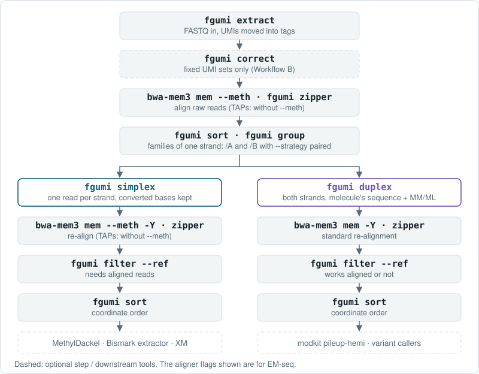

# Methylation Pipeline Guide

This guide shows how to run EM-seq and TAPs (Illumina 5-base) data through fgumi's consensus pipeline, for both simplex and duplex consensus, and documents every methylation option and tag. For what the output means and why, start with [Methylation Concepts](methylation-concepts.md).

## Scope and Requirements

| | EM-seq | TAPs |
|---|---|---|
| **Chemistry** | TET2 + APOBEC | TET oxidation + pyridine borane |
| **What gets converted** | Unmethylated C → T | Methylated C → T |
| **C in read at a reference C** | Methylated (protected) | Unmethylated (not a target) |
| **T in read at a reference C** | Unmethylated (converted) | Methylated (converted) |

- **Directional libraries only.** Read 1 (and unpaired reads) must sequence the converted original strand and Read 2 the copy made from it, so that Read 1 shows conversions as C→T and Read 2 as G→A in read orientation ([What Each Read Sees](methylation-concepts.md#what-each-read-sees)). Non-directional libraries (PBAT, single-cell bisulfite) are not supported.
- **Consensus callers.** `simplex` and `duplex` support methylation mode, enabled with `--methylation-mode em-seq|taps` and `--ref`. `codec` does not.
- **Reference.** The FASTA needs a `.dict` file (`samtools dict`). For EM-seq alignment, `bwa-mem3 mem --meth` needs an index built with `bwa-mem3 index --meth ref.fa`; bwameth works as well.
- **UMIs.** For EM-seq, synthesize the UMIs with methylated cytosines (5mC) so that conversion leaves them intact; an unmethylated C in a UMI is converted like any other. TAPs leaves synthetic UMIs unchanged, since their cytosines are unmethylated.

## Pipeline Overview

The methylation pipeline has the same structure as the [standard consensus pipeline](best-practices.md), with extra flags at the consensus, re-alignment and filter steps.



| Step | EM-seq | TAPs |
|------|--------|------|
| First alignment | `bwa-mem3 mem --meth` (bisulfite-aware) | `bwa-mem3 mem` (standard) |
| Consensus | `--methylation-mode em-seq --ref` | `--methylation-mode taps --ref` |
| Simplex re-alignment | `bwa-mem3 mem --meth -Y` | `bwa-mem3 mem -Y` |
| Duplex re-alignment | `bwa-mem3 mem -Y` | `bwa-mem3 mem -Y` |
| Filter | `--methylation-mode em-seq` | `--methylation-mode taps` |

For libraries with UMIs on both ends, use paired grouping with `simplex` by default, and `duplex` for per-molecule questions ([Choosing Simplex or Duplex](methylation-concepts.md#choosing-simplex-or-duplex)).

---

## Workflow A: Random UMIs

Random UMIs (for example random 8-mers ligated during library prep) need no correction against a list of known UMIs.

### Step 1: UMI Extraction

No methylation-specific flags are needed.

**A single UMI per read pair:**

```bash
fgumi extract \
  --inputs r1.fq.gz r2.fq.gz \
  --read-structures 8M+T +T \
  --sample "sample_name" \
  --library "library_name" \
  --output unmapped.bam \
  --threads 4
```

**UMIs on both ends** (paired grouping, simplex or duplex):

```bash
fgumi extract \
  --inputs r1.fq.gz r2.fq.gz \
  --read-structures 8M+T 8M+T \
  --sample "sample_name" \
  --library "library_name" \
  --output unmapped.bam \
  --threads 4
```

### Step 2: Alignment

**EM-seq**: most unmethylated cytosines read as T, so use a bisulfite-aware aligner:

```bash
fgumi fastq --input unmapped.bam \
  | bwa-mem3 mem --meth -p -t 16 ref.fa /dev/stdin \
  | fgumi zipper --unmapped unmapped.bam --reference ref.fa --output aligned.bam
```

**TAPs**: only methylated cytosines are converted, which leaves most of the read unchanged, so a standard aligner works:

```bash
fgumi fastq --input unmapped.bam \
  | bwa-mem3 mem -p -t 16 ref.fa /dev/stdin \
  | fgumi zipper --unmapped unmapped.bam --reference ref.fa --output aligned.bam
```

### Step 3: Sort

```bash
fgumi sort \
  --input aligned.bam \
  --output sorted.bam \
  --order template-coordinate \
  --threads 8 \
  --max-memory 4G
```

### Step 4: UMI Grouping

**UMIs on both ends** (the default simplex workflow, and duplex):

```bash
fgumi group \
  --input sorted.bam \
  --output grouped.bam \
  --strategy paired \
  --edits 1 \
  --family-size-histogram fam_sizes.txt \
  --threads 8
```

**A single UMI per read pair** (simplex only):

```bash
fgumi group \
  --input sorted.bam \
  --output grouped.bam \
  --strategy adjacency \
  --edits 1 \
  --family-size-histogram fam_sizes.txt \
  --threads 8
```

### Step 5: Consensus Calling

`--methylation-mode` and `--ref` enable methylation-aware consensus. Simplex keeps the converted bases ([Simplex Consensus](methylation-concepts.md#simplex-consensus)); duplex writes the molecule's sequence with `MM`/`ML` ([Duplex Consensus](methylation-concepts.md#duplex-consensus)).

**Simplex:**

```bash
fgumi simplex \
  --input grouped.bam \
  --output consensus.bam \
  --min-reads 1 \
  --min-input-base-quality 20 \
  --output-per-base-tags \
  --methylation-mode <em-seq|taps> \
  --ref ref.fa \
  --threads 8
```

**Duplex:**

```bash
fgumi duplex \
  --input grouped.bam \
  --output consensus.bam \
  --min-reads 1 \
  --min-input-base-quality 20 \
  --output-per-base-tags \
  --methylation-mode <em-seq|taps> \
  --ref ref.fa \
  --threads 8
```

### Step 6: Re-alignment

Consensus reads are unaligned and must be aligned again. Always pass `-Y`, so that supplementary alignments are soft-clipped rather than hard-clipped: a hard-clipped record no longer matches its per-base tags in length (`cu`/`ct`, and on duplex the read length `MN` that `MM`/`ML` were computed for), so filter skips it and `MM`/`ML` consumers ignore it.

**Simplex EM-seq** reads keep their converted bases, so re-align them with the bisulfite-aware aligner, as in Step 2:

```bash
fgumi fastq --input consensus.bam \
  | bwa-mem3 mem --meth -p -Y -t 16 ref.fa /dev/stdin \
  | fgumi zipper --unmapped consensus.bam --reference ref.fa --output consensus.mapped.bam
```

**Simplex TAPs** reads, and **duplex** reads of either chemistry, align with a standard aligner:

```bash
fgumi fastq --input consensus.bam \
  | bwa-mem3 mem -p -Y -t 16 ref.fa /dev/stdin \
  | fgumi zipper --unmapped consensus.bam --reference ref.fa --output consensus.mapped.bam
```

Reverse the per-base tags of reverse-strand reads exactly once: either here, with zipper's `--tags-to-reverse Consensus --tags-to-revcomp Consensus`, or in Step 7 with `filter --reverse-per-base-tags`, which handles the same tags, including the methylation counts (`cu`/`ct`/`au`/`at`/`bu`/`bt`). The commands on this page use filter. Do not do both, or every per-base tag is reversed twice and points at the wrong positions. If you reverse in zipper, filter still prints its end-of-run warning about reverse-mapped reads checked without `--reverse-per-base-tags`, because it cannot tell that zipper already reversed them; on that route the warning is expected and can be ignored.

### Step 7: Filtering

**Simplex** methylation filters find cytosines from the reference, so they need aligned reads: filter after re-alignment, with `--ref` and `--reverse-per-base-tags` (omit it if zipper already reversed the per-base tags in Step 6). An aligned BAM always contains some unmapped reads; the methylation filters leave unmapped simplex reads unchecked and report how many there were at the end of the run. **Duplex** reads carry their cytosines in their own sequence, so the filters work on them aligned or not.

**Simplex:**

```bash
fgumi filter \
  --input consensus.mapped.bam \
  --output filtered.bam \
  --ref ref.fa \
  --min-reads 3 \
  --max-base-error-rate 0.1 \
  --max-no-call-fraction 0.2 \
  --min-methylation-depth 3 \
  --methylation-mode <em-seq|taps> \
  --min-conversion-fraction 0.9 \
  --reverse-per-base-tags \
  --threads 8
```

**Duplex:**

```bash
fgumi filter \
  --input consensus.mapped.bam \
  --output filtered.bam \
  --ref ref.fa \
  --min-reads 10,5,3 \
  --max-base-error-rate 0.1 \
  --max-no-call-fraction 0.2 \
  --min-methylation-depth 4,2,1 \
  --require-single-strand-agreement \
  --methylation-mode <em-seq|taps> \
  --min-conversion-fraction 0.9 \
  --reverse-per-base-tags \
  --threads 8
```

With `--ref`, filter also recomputes the `NM`, `UQ` and `MD` alignment tags; see [Alignment Tags](#alignment-tags-nm-uq-md).

### Step 8: Final Sort

```bash
fgumi sort \
  --input filtered.bam \
  --output final.bam \
  --order coordinate \
  --threads 8
```

---

## Workflow B: Fixed UMIs

When the UMIs come from a fixed set (for example a synthesized pool of known sequences), add a correction step before alignment, which maps each observed UMI to the closest known one.

1. **UMI extraction**: as in Workflow A, Step 1.
2. **UMI correction**:

   ```bash
   fgumi correct \
     --input unmapped.bam \
     --output corrected.bam \
     --umi-files known_umis.txt \
     --max-mismatches 1 \
     --min-distance 1 \
     --metrics correction_metrics.txt \
     --threads 8
   ```

   `correct` compares the UMIs as sequenced, so a converted cytosine in an EM-seq UMI counts as a mismatch. Use UMIs synthesized with methylated cytosines (see [Scope and Requirements](#scope-and-requirements)).
3. **Alignment**: as in Workflow A, Step 2, but read the corrected BAM in both places, `fgumi fastq --input` and `fgumi zipper --unmapped`; otherwise zipper restores the uncorrected UMIs. For EM-seq:

   ```bash
   fgumi fastq --input corrected.bam \
     | bwa-mem3 mem --meth -p -t 16 ref.fa /dev/stdin \
     | fgumi zipper --unmapped corrected.bam --reference ref.fa --output aligned.bam
   ```

   For TAPs, drop `--meth`.
4. **Sort through final sort**: Workflow A, Steps 3-8.

---

## Reference

### Output Tags

Per-base arrays are in read orientation on the unaligned consensus; after re-alignment, `filter --reverse-per-base-tags` (or zipper's `--tags-to-reverse Consensus --tags-to-revcomp Consensus`) puts them in reference orientation.

**Simplex:**

| Tag | Type | Description |
|-----|------|-------------|
| `cu` | `B:s` | Per base: reads showing the unconverted base at an informative position |
| `ct` | `B:s` | Per base: reads showing the converted base at an informative position |

Informative positions are reference C for Read 1 and unpaired reads and reference G for Read 2, in read orientation. `cu` and `ct` are zero everywhere else.

**Duplex:** `cu`/`ct` combined over both strands, at the molecule's methylation calls rather than at reference positions (see [Duplex Consensus](methylation-concepts.md#duplex-consensus)), plus:

| Tag | Type | Description |
|-----|------|-------------|
| `au` | `B:s` | AB strand unconverted count |
| `at` | `B:s` | AB strand converted count |
| `bu` | `B:s` | BA strand unconverted count |
| `bt` | `B:s` | BA strand converted count |
| `MM` | `Z` | SAM-spec base modifications, one group per strand |
| `ML` | `B:C` | Modification probabilities, in the same order as `MM` |
| `MN` | `i` | The SEQ length `MM`/`ML` were computed for |
| `am` | `Z` | AB strand modifications, `MM` format, no `ML` companion |
| `bm` | `Z` | BA strand modifications, `MM` format, no `ML` companion |

The AB strand has the record's own read type and is informative at its read type's base; the BA strand is informative at the complementary base. Counts are present only at methylation calls, so at any position at most one strand has counts, and `cu = au + bu`, `ct = at + bt`.

### MM and ML (Duplex)

`MM` lists each strand's cytosines. The `C+m?` group (tracking C) is for the strand informative at C in the record's read orientation, and the `G-m?` group (tracking G, with the modification on the opposite strand) is for the strand informative at G. A duplex record with both strands carries both groups, `C+m?` first, with `ML` concatenated in the same order; `modkit pileup-hemi` pairs them into per-molecule CpG calls. `am` and `bm` hold one group each, chosen by the read type of that strand's reads in the record: `C+m?` for C→T reads (Read 1 type), `G-m?` for G→A reads (Read 2 type).

The `?` flag means that a tracked base that is not listed has unknown status (no evidence, not informative, or filtered), not that it is unmethylated. The tags follow the [SAM specification](https://samtools.github.io/hts-specs/SAMtags.pdf).

`cu` and `ct` mean the same in both chemistries: reads showing the unconverted base, and reads showing the converted base. The **`ML` probability** differs:

- **EM-seq**: `cu / (cu + ct)`, since a methylated C is protected from conversion.
- **TAPs**: `ct / (cu + ct)`, since a methylated C is the one converted.

As the SAM specification defines, `ML` stores a probability `p` as the integer `N` whose range `[N/256, (N+1)/256)` contains it: `floor(256 p)`, with `p` = 1 stored as 255.

### Duplex Base Quality

At a methylation call, the duplex base is the molecule's confirmed C (or G), and its quality is normally the sum of the two strands' qualities (capped, as for any duplex base). Where the cytosine's own strand shows the converted base and the reference has no cytosine there, the T could be an unmethylated cytosine the reference lacks or a T:A pair with an error on the other strand. Only the confirming strand supports the C, so the base takes that strand's quality alone.

### Filter Options

The methylation options of `filter` read the `cu`/`ct` counts written by methylation-mode consensus calling, and act only at methylation sites:

- **Simplex** (reference-anchored): an aligned reference cytosine of the read's own strand: reference C or G, depending on the read type and the direction it aligned. A site where the read shows a third base (a C>A or C>G variant) carries no call and is never masked. Simplex methylation lives in the sequence, so a failing site is masked to N.
- **Duplex** (molecule-based): a C or G in the read's own sequence, which is the molecule's sequence. A site without counts carries no call (the strands did not confirm it, or they conflicted). A CpG is a C followed in the read by a G: an insertion between them splits it, and a deletion between them joins one. An N is never a site. Duplex methylation lives in `MM`/`ML`, so a failing site's calls are dropped from `MM`/`ML` (and `am`/`bm`) and the base is left alone: a base that `--min-reads` accepted is never lost for lack of a methylation call. No reference is needed, so unaligned duplex reads are filtered too.

At every site a methylation filter rejects, filter also zeroes the counts (`cu`/`ct`, and `au`/`at`/`bu`/`bt` on duplex), so the counts never report a call that the sequence or `MM`/`ML` no longer carry. A dropped call becomes an unlisted base in its `?` group. Filter does not edit a group without `?`, where an unlisted base would read as unmethylated, and removes `MM`/`ML` instead. It also removes `MM`/`ML`/`MN`/`am`/`bm` when they no longer fit the sequence (for example after a tool other than `fgumi clip` hard-clipped it). Records whose `cu`/`ct` are missing or no longer match the sequence are left unchecked.

At the end of the run, filter reports each of these counts: unmapped simplex reads skipped, records without `cu`/`ct`, records whose `cu`/`ct` do not match the sequence, records whose modification tags were removed, duplex calls dropped from `MM`/`ML`, and single-strand records that `--require-strand-methylation-agreement` could not be applied to. It says so plainly when no record was checked at all. Without `--reverse-per-base-tags`, it also reports how many reverse-mapped reads the methylation filters checked, whose counts were read at the wrong positions unless they had already been reversed.

#### `--min-methylation-depth`

Per-site filtering on methylation depth (`cu + ct`): the number of reads that made a methylation call there, a subset of the read depth that `--min-reads` uses.

On a simplex read, a site with depth below the first value is masked to N; any further values are ignored.

On a duplex read, the one to three values expand like `--min-reads` into `x,y,z`: the total, the better-supported strand, and the worse-supported strand. The C and G of a CpG are called by different strands, so each CpG is checked as a pair: both calls are dropped unless their depths sum to at least `x`, the better half reaches `y` and the worse half reaches `z`. All four [methylation states](methylation-concepts.md#hemimethylation) of a CpG are tested the same way. A half without a call is not tested, and its partner, no longer part of a CpG in this molecule, is tested on its own against `y`, like every other call (CHG and CHH cytosines, and a CpG half whose partner lies outside the read or next to an N).

| Values | Meaning |
|--------|---------|
| `4` | `4,4,4`: each half of a CpG needs 4 reads, so 8 in total |
| `4,2` | `4,2,2` |
| `4,2,1` | a CpG needs 4 reads across both strands, 2 on the better strand and 1 on the other |

Worked examples with `--min-methylation-depth 4,2,1`:

| Reads calling the C half | Reads calling the G half | Checks | Result |
|---|---|---|---|
| 3 | 1 | total 4 ≥ 4, better 3 ≥ 2, worse 1 ≥ 1 | both calls kept |
| 2 | 1 | total 3 < 4 | both calls dropped |
| 3 | no call (two-strand record) | the G half is not tested; the C half alone: 3 ≥ 2 | C call kept |
| 1 | no call (two-strand record) | the C half alone: 1 < 2 | C call dropped |
| 4 | none, on a `bD` = 0 record | the absent strand counts as 0: worse 0 < 1 | the pair fails: C call dropped |

On a single-strand duplex record (`bD` = 0) a CpG half without counts belongs to the absent strand and counts as depth 0, so `z` > 0 drops the calls of every CpG on such records; set `z` to 0 to keep them.

#### `--require-strand-methylation-agreement`

Duplex only. At each CpG with a call on both halves, compares the call at the C with the call at the G (the majority of `cu` versus `ct` at each); the two halves are called by different strands. If one calls methylated and the other unmethylated, both calls are dropped from `MM`/`ML`. A half with `cu` = `ct` has no majority and never disagrees. On simplex reads the option does nothing, and filter reports how many reads it skipped.

This is analogous to `--require-single-strand-agreement`, but for methylation at CpGs rather than base identity. It is an opt-in artifact filter: a hemimethylated CpG is real biology, and this option removes it. It is not part of the recommended duplex commands.

#### `--min-conversion-fraction`

Read-level filter that checks conversion worked. Requires `--methylation-mode`, and takes a value between 0.0 and 1.0.

It computes the conversion fraction at the read's non-CpG cytosines with evidence. On a simplex read these are reference C whose next reference base is not G (top-strand reads) and reference G whose previous reference base is not C (bottom-strand reads). On a duplex read they come from the sequence: a C not followed by G and a G not preceded by C; a cytosine whose neighbour is N or outside the read has unknown context and is not counted. CpG positions are excluded, because their methylation varies.

- **EM-seq**: requires `ct / (cu + ct) >= threshold`. Non-CpG cytosines are expected to be unmethylated and therefore converted, so a high fraction means good conversion.
- **TAPs**: requires `cu / (cu + ct) >= threshold`. Non-CpG cytosines are expected to be unmethylated and therefore *not* converted, so a high fraction means good specificity.

A read with no non-CpG cytosines passes.

### Alignment Tags (NM, UQ, MD)

With `--ref`, `filter` (and `clip`) recompute `NM`, `UQ` and `MD` from the read's sequence. A simplex methylation read (one with `cu`/`ct` and no duplex tags) keeps its converted bases, so `NM` and `UQ` do not count the conversions of the read's original strand, and a well-converted read does not look divergent to `NM`-based filters. Reads from the top strand (Read 1 or fragment forward, Read 2 reverse) do not count a reference C read as T; reads from the bottom strand do not count a reference G read as A. Every other difference still counts, including `N` and the opposite direction.

`MD` always lists every difference, so the sequence, CIGAR and `MD` reconstruct the reference, as with `samtools calmd`; it can therefore differ from the `MD` a bisulfite-aware aligner wrote. A duplex read, whose sequence is the molecule's, is scored literally. The rule follows the read, not `--methylation-mode`.

`clip` keeps `MM`/`ML` in step with the clipped read: `--clipping-mode soft-with-mask` masks the clipped bases to N and hard clipping removes them, and either way their calls are dropped from `MM`/`ML` (and `am`/`bm`); after hard clipping, `MN` (when present) is the new read length. `--auto-clip-attributes` leaves these tags to that step. Tags that cannot be kept in step are removed instead, as filter does, and clip reports how many records lost them at the end of the run: for example a group without the `?` flag that would lose a call, or a read that clipping shortened and then unmapped, which leaves no record of where the removed bases were. Unlike filter, clip does not zero `cu`/`ct`.

### Recommended Parameters

Both run `filter` on the re-aligned consensus reads (Steps 6 and 7). Drop `--reverse-per-base-tags` if zipper already reversed the per-base tags.

**Simplex (moderate stringency):**

```bash
fgumi simplex --min-reads 1 --min-input-base-quality 20 --output-per-base-tags \
  --methylation-mode <em-seq|taps> --ref ref.fa
# re-align and zipper the consensus reads (Step 6), then filter the aligned BAM:
fgumi filter --ref ref.fa --reverse-per-base-tags --min-reads 3 --max-base-error-rate 0.1 \
  --min-methylation-depth 3 --methylation-mode <em-seq|taps> --min-conversion-fraction 0.9
```

**Duplex (high specificity):**

```bash
fgumi duplex --min-reads 1 --min-input-base-quality 20 --output-per-base-tags \
  --methylation-mode <em-seq|taps> --ref ref.fa
# re-align and zipper the consensus reads (Step 6), then filter the aligned BAM:
fgumi filter --ref ref.fa --reverse-per-base-tags --min-reads 10,5,3 --max-base-error-rate 0.1 \
  --min-methylation-depth 4,2,1 --require-single-strand-agreement \
  --methylation-mode <em-seq|taps> --min-conversion-fraction 0.9
```

Methylation depth can never exceed read depth, so a `--min-methylation-depth` above `--min-reads` masks sites that `--min-reads` keeps. Keep it at or below `--min-reads`.

To mark duplicates without consensus calling, use `fgumi dedup` (see `fgumi dedup --help`); it has no methylation-specific options.

---

## Troubleshooting

### Low Family Sizes / Too Many UMI Groups

If family size histograms show many singletons:

1. Check that `--edits` suits your UMI length.
2. For fixed UMIs, check the correction metrics for how many UMIs are corrected versus rejected.
3. **EM-seq only:** check that the UMIs are synthesized with methylated cytosines, so that conversion does not change them.

### Missing MM/ML Tags on Output

Only `duplex` writes `MM`/`ML`. A simplex read keeps the converted bases, so its methylation is in the sequence itself, with the counts in `cu`/`ct`. Also check that the consensus caller was given both `--methylation-mode` and `--ref`, and that the reference has a `.dict` file (`samtools dict`). On re-aligned duplex reads, pass `-Y` to the aligner so supplementary alignments are not hard-clipped.

### Unexpected Masking from Methylation Depth

1. Single-strand duplex records (`bD` = 0) fail every CpG pair when the third `--min-methylation-depth` value is above 0, which drops all their CpG calls; set it to 0 to keep them.
2. Without `--reverse-per-base-tags` (or an equivalent reversal of `cu`/`ct`), counts on reverse-strand reads point at the wrong positions; filter reports at the end of the run how many reverse-mapped reads were checked without it.

### Unexpected Masking from Strand Methylation Agreement

`--require-strand-methylation-agreement` applies only to duplex reads at CpG sites. If it drops many calls:

1. Check that your library has enough duplex coverage at CpG sites.
2. Hemimethylation is real: the option drops every hemimethylated CpG, and there are more of them where methylation is being gained or lost. Drop the option unless you need it to remove artifacts.

### Methylation Filters Skip Unmapped Reads

On simplex reads the methylation filters find cytosines from the alignment, so they leave unmapped simplex reads unchecked, and filter reports how many it skipped, saying so plainly when it was every read. Run `filter` after re-alignment. Duplex reads need no alignment.

`runall` cannot re-align between the consensus caller and filter, so it rejects filter's methylation options on a chain where filter follows `simplex`: re-align the consensus reads, then run `runall --start-from filter` or `fgumi filter`. After `duplex` the options are accepted. See [Running Pipelines](running-pipelines.md).

### Reads Filtered by Conversion Fraction

If many reads fail `--min-conversion-fraction`:

1. **EM-seq:** enzymatic conversion may be incomplete.
2. **TAPs:** non-CpG cytosines are being converted, which suggests low TAPs specificity.
3. Try a lower threshold (for example 0.8 instead of 0.9).
4. Check the overall conversion rate in your library QC metrics.
5. Reads with no non-CpG cytosines (for example short reads in AT-rich regions) always pass.

### Using the Wrong Methylation Mode

With `--methylation-mode em-seq` on TAPs data (or the reverse), every call is inverted: methylated positions get low probabilities and unmethylated ones high. If downstream results show unexpected methylation patterns, check the mode. The same inversion happens when an EM-seq/bisulfite sequence-based caller (MethylDackel, Bismark's extractor) reads TAPs simplex output; see [Choosing Simplex or Duplex](methylation-concepts.md#choosing-simplex-or-duplex).
