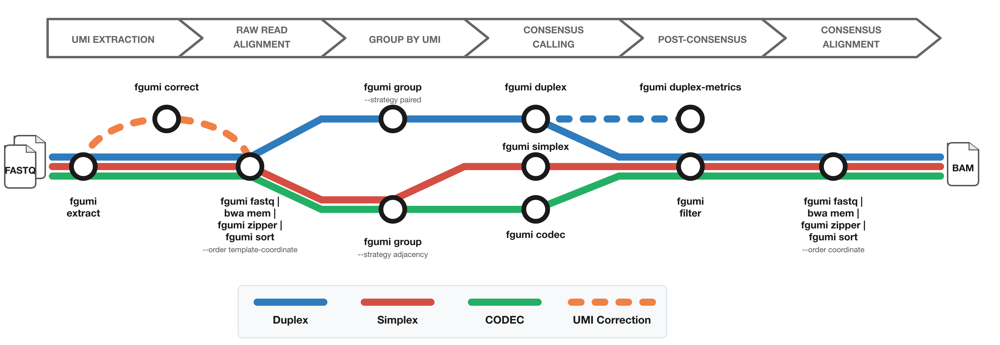

<h1><span style="color:#26a8e0">fg</span><span style="color:#38b44a">umi</span></h1>

High-performance tools for UMI-tagged sequencing data: extraction, grouping, and consensus calling.



The diagram shows the workflow from FASTQ files to filtered consensus reads:
- **Red**: Simplex (single-strand) consensus
- **Blue**: Duplex (double-strand) consensus
- **Green**: CODEC consensus
- **Orange**: Optional UMI correction for fixed UMI sets

## Where to Use fgumi

### Command Line

Install and run fgumi directly on your data. See the [Getting Started](guide/getting-started.md) guide.

### Nextflow Pipeline

Use [fastquorum](https://github.com/fulcrumgenomics/fastquorum) for an end-to-end Nextflow workflow from FASTQ to consensus reads using fgumi.

### Latch.bio

Run fgumi in the cloud with a point-and-click interface via [Latch.bio](https://latch.bio) — no installation required.

## Installation

### Pre-built Binaries

Pre-built binaries for common operating systems and architectures are attached to each [release](https://github.com/fulcrumgenomics/fgumi/releases/latest).

### Cargo

```bash
cargo install fgumi
```

### Bioconda

```bash
conda install -c bioconda fgumi
```

### From Source

```bash
git clone https://github.com/fulcrumgenomics/fgumi
cd fgumi
cargo build --release
```

## Available Commands

| Command | Description |
|---------|-------------|
| `extract` | Extract UMIs from FASTQ files |
| `correct` | Correct UMIs based on sequence similarity |
| `fastq` | Convert BAM to FASTQ format |
| `zipper` | Restore original FASTQ from unaligned BAM |
| `sort` | Sort BAM by coordinate/queryname/template |
| `group` | Group reads by UMI |
| `dedup` | Mark/remove UMI-aware duplicates |
| `simplex` | Call single-strand consensus reads |
| `duplex` | Call duplex consensus reads |
| `codec` | Call CODEC consensus |
| `filter` | Filter consensus reads |
| `clip` | Clip overlapping read pairs |
| `duplex-metrics` | Collect duplex metrics |
| `review` | Review consensus variants |
| `downsample` | Downsample BAM by UMI family |
| `simplex-metrics` | Collect simplex metrics |
| `merge` | Merge sorted BAM files |

See the [Tool Reference](tools/README.md) for detailed documentation of each command.
